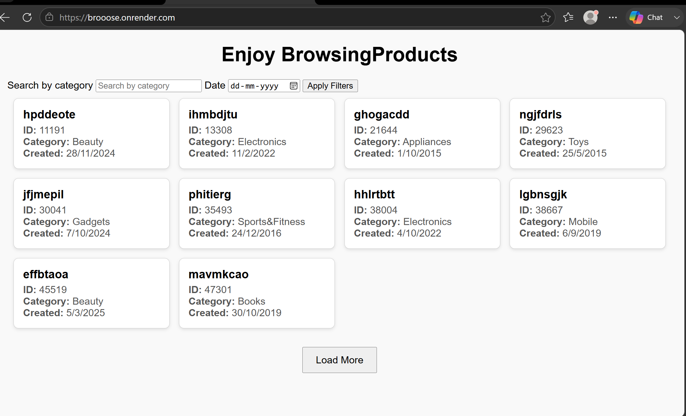

# Brooose
This is a backend application to let user browse 200000 products using filters and category .
Broose API
## Overview
Broose API is a backend service built with Node.js and Express, deployed on Render. It provides product data with features like filtering by newest first product, pagination, and static file routing. It demonstrates RESTful API design, deployment, and integration with FreeDB.

## Features
- fetch products api
- csv-parser seeding(seeding file is included in the repo named "seedP.js")
- Partial RESTful API endpoints for product data
- Pagination and filtering support
- Static file routing for assets
- Deployment on Render with environment configuration

## Tech Stack

- **Backend:** Node.js, Express.js
- **Database/Seeding:** mysql, CSV-parser, FreeDB
- **Deployment:** Render
- **Version Control:** Git, GitHub

  
## Installation
Clone the repository: git clone <repo-url>

Navigate into the project folder: cd broose

Install dependencies: npm install

Configure environment variables in .env (e.g., database credentials, port).

Start the server: npm start

## Usage
Run locally: http://localhost:3000/products

Example query: http://localhost:3000/products?page=2&limit=10

Use tools like Postman or cURL to test endpoints.

## API Endpoints
https://broose.onrender.com → shows backened integrated with frontend.(For visual browsing)

(For running backend and getting raw json ) -

GET/products → Returns 10 products by default (paginated JSON). Use query parameters like limit, category, and startDate to refine results.

GET /products?page=2&limit=10 → Paginated products(You can adjust the limits)

GET /products?category=electronics → Returns products filtered by category.(adjust category )

## Live Demo
Live demo: https://broose.onrender.com

##📸 Screenshots

##📈 Future Improvements
Add authentication and user roles

Improve error handling and validation

Integrate with MongoDB for persistent storage

Write unit tests for endpoints

## Contributing
Contributions are welcome! Fork the repository, make changes, and submit a pull request.

## License
This project is licensed under the MIT License.
